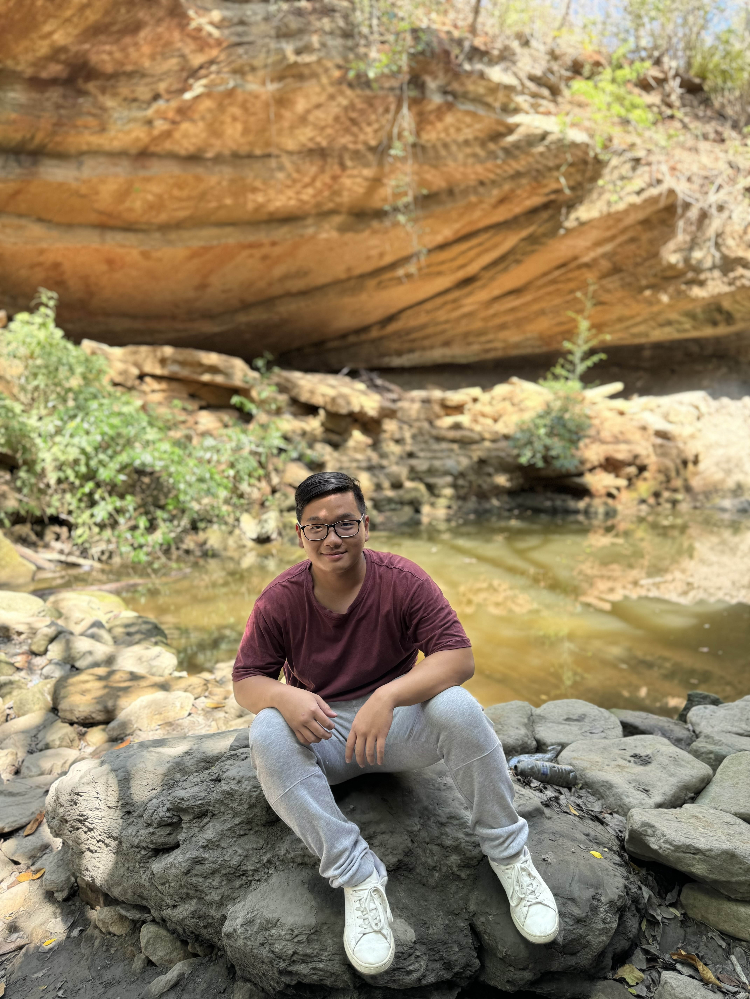

# **Team Members** 

| **Integrant**       | **Photo**                   | **Description**                                                                                                                                                                                                                                                                             |
|----------------------|------------------------------|---------------------------------------------------------------------------------------------------------------------------------------------------------------------------------------------------------------------------------------------------------------------------------------------|
| **Kenny Zhu**         |   | **An eighth semester student of systems engineering at the Universidad del Norte in Barranquilla, Colombia, he is currently 22 years old.** He is passionate about artificial intelligence, data science, data analysis, optimization and mathematics, and seeks to expand his knowledge in that field. He has experience in the creation of software projects, especially in the backend and database modeling part, and also has experience in the part of data analysis and construction of machine learning models.                                                                                        |
| **Vanessa Fontalvo**  |  | **Currently a 10th-semester Systems and Computer Engineering student**, passionate about computer networks and frontend web development. With experience in React, I enjoy creating dynamic and efficient user interfaces. Fascinated by the way network infrastructure works and how web applications can be optimized for better user experiences, I’m driven by the blend of creativity in web design and the technical demands of networking. Always seeking challenging projects to grow, with a firm belief in technology’s power to transform the world. | 
| **Juan Padilla**  |        
|**Valeria Jiménez**|
|**Aaron**|